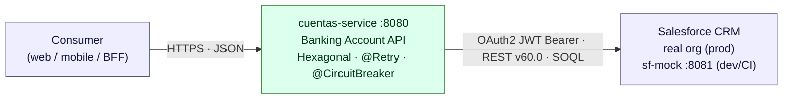

# Salesforce Banking Integration — Reference Architecture


A **reference implementation** for integrating a domain service with Salesforce CRM under real-world reliability and security constraints — and doing it in a way that stays fully testable without a live Salesforce org.

It is aimed at **solution architects** looking for a concrete, runnable example of:

- **Hexagonal architecture** that isolates the domain from a volatile external system
- **Resilient integration** — retry, timeout, circuit breaker, transparent token refresh
- **Zero-touch OAuth 2.0 JWT Bearer** authentication
- **A protocol-faithful mock** (`sf-mock`) with chaos injection, so the *production code path* runs unchanged in dev and CI

> 📐 **Start here:** [`docs/architecture.md`](docs/architecture.md) — C4 views, sequence diagrams, the error taxonomy, and an ADR log explaining every design choice.

## System at a glance



Consumers never see Salesforce semantics: the service exposes a small, stable contract and absorbs the CRM's auth flow, field names, error catalogue, and failure modes. Swapping the mock for a real org is a **configuration change**, not a code change.

## Modules

| Module | Port | What it does |
| --- | --- | --- |
| [`cuentas-service`](cuentas-service/README.md) | `:8080` | Banking account lookup service. Owns the domain, resilience, and CRM integration (hexagonal architecture). |
| [`sf-mock`](sf-mock/README.md) | `:8081` | Simulates the Salesforce REST API v60.0 — OAuth2 JWT Bearer, Account/Case sObjects, SOQL, and chaos injection for fault-tolerance testing. |

## Key design decisions

A short excerpt from the [full ADR log](docs/architecture.md#7-architecture-decisions):

| Decision | Why |
| --- | --- |
| Hexagonal architecture (ports & adapters) | Keep the domain unit-testable and the CRM swappable. |
| Own DTO distinct from the Salesforce DTO | The consumer contract must not leak CRM field names or evolve with the org. |
| Translate `5xx`/`429` → one technical failure lane | Simple, predictable fault tolerance; consumers get a clean `503 + Retry-After`. |
| `@Retry` on idempotent operations only | Safe to repeat `GET`/`PATCH`; a creating `POST` would need an idempotency key. |
| Protocol-faithful mock over recorded stubs | Same wire format + chaos modes ⇒ production code path runs unchanged in dev/CI. |

## Build

```bash
./mvnw clean package
```

## Run

### Dev mode (two terminals, hot reload)

```bash
./mvnw quarkus:dev -pl sf-mock            # start the mock first (:8081)
./mvnw quarkus:dev -pl cuentas-service     # start the service   (:8080)
```

### Podman / Docker

```bash
docker compose up --build
```

Then try it:

```bash
curl http://localhost:8080/cuentas/001AAA        # lookup by CRM id
curl "http://localhost:8080/cuentas?limite=5"    # paginated list
```

Simulate a Salesforce outage and watch the resilience layer react:

```bash
curl -X POST http://localhost:8081/mock-admin/chaos/ERROR_500
curl http://localhost:8080/cuentas/001AAA        # → 503 CRM_NO_DISPONIBLE (retry + breaker)
curl -X POST http://localhost:8081/mock-admin/chaos/OK
```

## Documentation map

| You want to… | Read |
| --- | --- |
| Understand the architecture, patterns, and trade-offs | [`docs/architecture.md`](docs/architecture.md) |
| Consume or operate the account API | [`cuentas-service/README.md`](cuentas-service/README.md) |
| Understand / extend the Salesforce mock | [`sf-mock/README.md`](sf-mock/README.md) |

## Stack

- **Java 21** + **Quarkus 3.37.3**
- Hexagonal architecture (`cuentas-service`)
- MicroProfile REST Client · SmallRye Fault Tolerance · SmallRye JWT
- In-memory, protocol-faithful Salesforce mock (`sf-mock`)
- CI: GitHub Actions (path-filtered per-module matrix) · SonarQube · JaCoCo · Podman images
