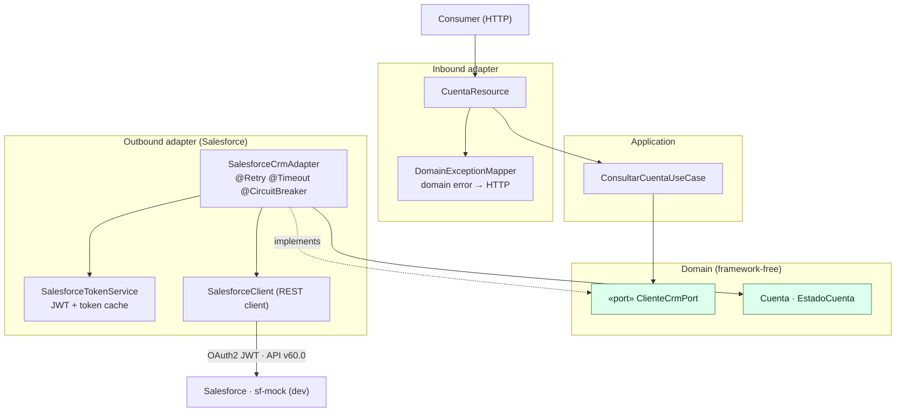

# cuentas-service · Banking Account API

A Quarkus microservice that exposes a small, stable REST API for querying bank accounts, backed by **Salesforce CRM** behind a **hexagonal (ports-and-adapters) architecture**. It owns the domain, the CRM integration, and all the resilience and security concerns of talking to an external system of record.

```
GET  /cuentas/{id}           Lookup account by CRM id
GET  /cuentas?limite=10      Paginated account list
```

> 📐 For the full architectural picture — C4 views, sequence diagrams, error taxonomy, and the ADR log — see [`../docs/architecture.md`](../docs/architecture.md). This README is the **operator/consumer** guide.

## Why it's built this way

| Goal | How it's achieved |
| --- | --- |
| Keep the domain independent of Salesforce | `ClienteCrmPort` (port) is implemented by `SalesforceCrmAdapter` (adapter). The use case knows nothing about the CRM. |
| Never leak CRM shapes to consumers | The API returns `CuentaResponse`, mapped from the domain — separate from the Salesforce `AccountDto`. |
| Survive CRM instability | `@Retry` + `@Timeout` + `@CircuitBreaker` on the adapter, plus transparent 401 token refresh. |
| Authenticate without users or passwords | OAuth 2.0 JWT Bearer flow with a cached token. |
| Stay testable without a live org | All calls go to `sf-mock` in dev/CI; unit tests use a fake port. |

## Architecture (component view)

Dependencies point inward only — infrastructure depends on the domain, never the reverse.



In development, every Salesforce call goes to `sf-mock` (`:8081`) — a protocol-faithful mock supporting OAuth2, Account/Case CRUD, SOQL, and chaos injection.

## REST API

### Lookup account by id

```bash
curl http://localhost:8080/cuentas/001AAA
```

```json
{
  "id": "001AAA",
  "nombre": "Juan Perez",
  "numero": "ACC-12345",
  "estado": "ACTIVO",
  "operativa": true
}
```

`operativa` is a domain-derived flag (`true` only when `estado == ACTIVO`) — an example of the service adding business meaning on top of raw CRM data.

### List accounts

```bash
curl "http://localhost:8080/cuentas?limite=5"
```

Paged transparently: the adapter walks Salesforce's `nextRecordsUrl` cursor (2000 rows/page) and flattens the result. A business cap of `10_000` is applied in the use case.

### Error responses

| Status | Body | When |
| --- | --- | --- |
| `404` | `{"error": "CUENTA_NO_ENCONTRADA", ...}` | Account not found in CRM (a **business** outcome) |
| `503` | `{"error": "CRM_NO_DISPONIBLE", ...}` + `Retry-After: 15` | CRM down, rate-limited, timed out, or circuit-breaker open (a **technical** failure) |
| `500` | `{"error": "ERROR_INTERNO"}` | Unexpected/unmapped error |

The `404`-vs-`503` split is deliberate: business errors propagate untouched, technical errors funnel into one retryable lane. See [error taxonomy](../docs/architecture.md#61-resilience).

## Salesforce integration

### Authentication — OAuth 2.0 JWT Bearer (no user interaction)

```
SalesforceTokenService
  ├─ mints an RS256-signed JWT assertion (privateKey.pem · iss=clientId · sub=username · exp=3min)
  ├─ POST /services/oauth2/token   (grant_type = …:jwt-bearer)
  ├─ caches access_token (local TTL 20 min, refreshed 60 s early)
  └─ refresh() is synchronized → no token stampede under load
```

On a `401` (server-side session expiry), the token is invalidated and the request retried **once**, transparently. See [sequence 5.2](../docs/architecture.md#52-expired-session--transparent-401-refresh).

> **Production note:** the RS256 private key is the only secret. Mount it from a secrets manager (`smallrye.jwt.sign.key.location`) — never bake it into the image.

### Client operations

All calls go through `SalesforceClient` (`@RegisterRestClient`); the `SalesforceAuthFilter` attaches the Bearer header automatically.

```java
AccountDto acc = sf.getAccount("001AAA");                 // GET /sobjects/Account/{id}
QueryResultDto res = sf.query("SELECT Id, Name FROM Account LIMIT 10");  // SOQL, paged
sf.updateAccount("001AAA", Map.of("Estado_Cliente__c", "SUSPENDIDO"));   // PATCH
```

### Fault tolerance

| Mechanism | Scope | Config | Note |
| --- | --- | --- | --- |
| `@Retry` | all ops (PATCH 1×) | 2 retries, 500 ms delay, 200 ms jitter | Retries only on `CrmNodisponibleException`; **idempotent ops only**. |
| `@Timeout` | all ops | 8 s | Bounds worst-case consumer latency. |
| `@CircuitBreaker` | account lookup | 10 req, 50% failure ratio, 15 s open | Fail fast when the CRM is already down. |
| 401 refresh | all ops | invalidate token + 1 retry | Recovers from session expiry. |

## Chaos testing (with sf-mock)

`sf-mock` ships **315 pre-loaded accounts** and fault modes to exercise the resilience layer:

```bash
# Simulate a Salesforce outage → 503, triggers retry + circuit breaker
curl -X POST http://localhost:8081/mock-admin/chaos/ERROR_500
curl http://localhost:8080/cuentas/001AAA

# Simulate a timeout (30s sleep) → @Timeout cuts at 8s → 503
curl -X POST http://localhost:8081/mock-admin/chaos/TIMEOUT

# Simulate an expired session → auto token refresh → success
curl -X POST http://localhost:8081/mock-admin/revocar-tokens
curl http://localhost:8080/cuentas/001AAA

# Back to normal
curl -X POST http://localhost:8081/mock-admin/chaos/OK
```

## Run

### Dev mode (hot reload, points to sf-mock on :8081)

```bash
# Terminal 1: start the mock
cd ../sf-mock && ./mvnw quarkus:dev

# Terminal 2: start the service
./mvnw quarkus:dev   # http://localhost:8080
```

### JAR

```bash
./mvnw package
java -jar target/quarkus-app/quarkus-run.jar
```

### Native executable

```bash
./mvnw package -Dnative
./target/cuentas-service-1.0.0-SNAPSHOT-runner
```

### Podman / Docker

```bash
./mvnw package
podman build -f src/main/docker/Dockerfile.jvm -t cuentas-service .
podman run -d --rm -p 8080:8080 \
  -e SF_BASE_URL=http://host.containers.internal:8081 \
  -e SF_LOGIN_URL=http://host.containers.internal:8081 \
  --name cuentas-service cuentas-service
```

Or via docker-compose from the repo root: `docker compose up --build`.

## Health

| Endpoint | Purpose |
| --- | --- |
| `/q/health` | Aggregate status |
| `/q/health/live` | Liveness probe (Kubernetes) |
| `/q/health/ready` | Readiness probe (Kubernetes) |

The custom `SalesforceReadinessCheck` verifies it can obtain a Salesforce token — so a pod only receives traffic once it can actually reach the CRM's auth endpoint.

## Configuration

| Variable | Meaning | Local default |
| --- | --- | --- |
| `SF_BASE_URL` | Salesforce data API base | `http://localhost:8081` |
| `SF_LOGIN_URL` | Salesforce token endpoint base | `http://localhost:8081` |
| `app.salesforce.auth.*` | Connected App client id / username / audience | fake values for the mock |
| `smallrye.jwt.sign.key.location` | RS256 private key location | `classpath:privateKey.pem` (replace in prod) |

## Stack

- **Java 21** + **Quarkus 3.37.3**
- Hexagonal architecture (domain → application → infrastructure)
- REST via `quarkus-rest-jackson`; Salesforce client via MicroProfile REST Client
- Fault tolerance via SmallRye (`@Retry`, `@Timeout`, `@CircuitBreaker`)
- JWT assertion via SmallRye JWT Build
- Tests: `@QuarkusTest` + WireMock stub of the Salesforce API
