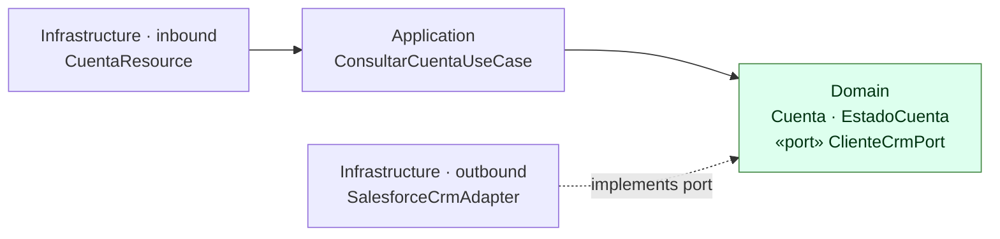

# ADR-0001 — Adopt hexagonal architecture (ports & adapters) in `cuentas-service`

| | |
| --- | --- |
| **Status** | Accepted |
| **Date** | 2026-07-20 |
| **Scope** | `cuentas-service` |
| **Related** | [ADR-0002](0002-own-consumer-contract-dto.md), [ADR-0007](0007-protocol-faithful-mock.md), [ADR-0010](0010-constructor-injection.md) |

## Context

The account domain depends on Salesforce as its system of record. Salesforce is **volatile in ways
we do not control**:

- Field names are org configuration (`Estado_Cliente__c` is a custom field, renamable by an admin).
- Picklist values can be added without notice.
- The API is versioned (`v60.0`) and moves on its own release cadence.
- It has its own auth flow, error catalogue, and failure modes.

A naive layering — REST resource calls a service that calls a Salesforce REST client — makes every
one of those concerns leak into business code, and makes the business logic untestable without
either a live org or a heavyweight HTTP mock in every test.

## Decision

We structure `cuentas-service` as three concentric layers with dependencies pointing **inward only**:



| Layer | Package | Rule |
| --- | --- | --- |
| Domain | `domain.*` | No framework imports. Pure Java. |
| Application | `application.*` | Orchestrates use cases against ports. No transport, no CRM. |
| Infrastructure | `infrastructure.*` | All the "how". Swappable. |

The seam is `domain.port.out.ClienteCrmPort`, implemented by
`infrastructure.out.salesforce.SalesforceCrmAdapter`. CDI wires the two together in exactly one
place, `infrastructure.UseCaseProducer`:

```java
@Produces
@ApplicationScoped
ConsultarCuentaUseCase consultarCuentaUseCase(ClienteCrmPort crm) {
    return new ConsultarCuentaUseCase(crm);   // CDI injects SalesforceCrmAdapter
}
```

## Consequences

**Positive**

- `ConsultarCuentaUseCase` has **zero** Quarkus/JAX-RS imports. It can be unit-tested against a
  hand-written fake `ClienteCrmPort` in microseconds — no container start, no HTTP.
- Replacing Salesforce with another CRM is a new adapter class plus one line of wiring. Nothing in
  `domain.*` or `application.*` changes.
- The compiler enforces the boundary: the domain literally cannot reference `AccountDto`, because
  the dependency does not exist in that direction.
- Business rules have a single home. The `min(limite, 10_000)` cap lives in the use case, not
  scattered across a resource and an adapter.

**Negative / accepted trade-offs**

- More classes and one more level of indirection than a service this small strictly needs. For a
  two-endpoint API, a port interface with a single implementation looks like ceremony.
- Newcomers must learn where things go before they can add a feature.
- The port interface is a second thing to change when an operation's signature changes.

We accept these because the value is proportional to the *volatility of the dependency*, not to the
size of the service — and the CRM is the most volatile thing here.

## Alternatives considered

| Alternative | Why not |
| --- | --- |
| Classic three-layer (resource → service → repository) | The "repository" would return Salesforce DTOs, so CRM field names and error semantics reach business code anyway. The boundary would be conventional, not enforced. |
| Call the Salesforce REST client directly from `CuentaResource` | Fastest to write; makes every test an integration test and couples the HTTP contract to the CRM's shape. |
| Hexagonal, but with the port in the application layer | The port expresses a *domain* need ("look up a customer account"). Placing it in `application` would let the domain depend on the application layer to express its own vocabulary. |
