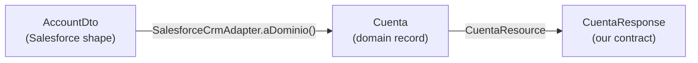

# ADR-0002 — Expose an own consumer contract (`CuentaResponse`), distinct from the Salesforce DTO

| | |
| --- | --- |
| **Status** | Accepted |
| **Date** | 2026-07-20 |
| **Scope** | `cuentas-service` |
| **Related** | [ADR-0001](0001-hexagonal-architecture.md), [ADR-0003](0003-two-lane-error-taxonomy.md) |

## Context

Salesforce returns `Account` records in its own shape: PascalCase JSON, platform field names
(`Id`, `Name`, `AccountNumber`), and org-specific custom fields (`Estado_Cliente__c`). That shape is
a product of *someone else's* configuration and release cycle.

It is tempting to serialize `AccountDto` straight back to the consumer — it already has the data and
the mapping is free. The cost of doing so is invisible until the day a Salesforce admin renames a
field and every mobile client breaks.

## Decision

We define a separate outbound DTO, `infrastructure.in.rest.dto.CuentaResponse`, as the public
contract. The chain is:



Neither the domain nor the consumer contract ever imports a Salesforce type. The only place the two
vocabularies meet is `SalesforceCrmAdapter.aDominio(...)`, which also coerces unknown picklist
values to `EstadoCuenta.DESCONOCIDO` rather than throwing:

```java
try {
    estado = EstadoCuenta.valueOf(dto.estadoCliente());
} catch (IllegalArgumentException ex) {
    estado = EstadoCuenta.DESCONOCIDO;   // CRM config drift must not become a 500
}
```

## Consequences

**Positive**

- CRM field renames, added picklist values, and API version bumps are absorbed in one method
  instead of breaking consumers.
- The public contract can be designed for consumers (naming, granularity, what to omit) rather than
  inheriting whatever the CRM happens to store.
- We can withhold fields. Salesforce `Account` carries far more than a banking consumer should see;
  the DTO is an allow-list by construction.
- Config drift degrades gracefully: an unknown state renders as `DESCONOCIDO`, not a `500`.

**Negative / accepted trade-offs**

- Three representations of the same concept (`AccountDto`, `Cuenta`, `CuentaResponse`) and two
  mappings to maintain.
- Adding a field is a four-file change instead of one.
- The mappings are hand-written, so a field can be silently forgotten — this needs test coverage
  rather than trust.

## Alternatives considered

| Alternative | Why not |
| --- | --- |
| Serialize `AccountDto` directly to consumers | Couples the public API to org configuration. A field rename in Salesforce becomes a breaking change for every client, with no compile-time warning. |
| Serialize the domain `Cuenta` record directly | Better than the DTO, but conflates two contracts that change for different reasons: the domain model evolves with business rules, the API contract with consumer needs and compatibility obligations. |
| Generic `Map<String, Object>` passthrough | No contract at all — every consumer reimplements the mapping, and typos surface in production. |
