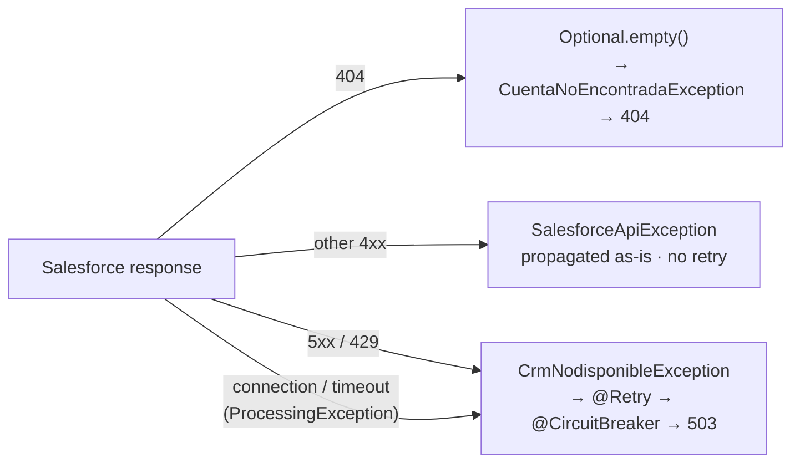

# ADR-0003 — Split CRM errors into two lanes: business and technical

| | |
| --- | --- |
| **Status** | Accepted |
| **Date** | 2026-07-20 |
| **Scope** | `cuentas-service` |
| **Related** | [ADR-0006](0006-retry-on-idempotent-operations-only.md), [ADR-0009](0009-single-503-at-the-edge.md) |

## Context

Salesforce can fail in many ways: `404` for a missing record, `400` for a malformed SOQL query,
`401` for an expired session, `403` for insufficient permissions, `429` when the org's API limits
are exhausted, `500`/`503` when the platform itself is degraded, plus connection failures and
timeouts that never produce an HTTP status at all.

Fault tolerance needs a *predicate*: `@Retry(retryOn = ...)` and `@CircuitBreaker` must know which
failures are worth repeating. Retrying a `404` is pointless. Retrying a `400` is pointless and
loops. Not retrying a `503` throws away the whole reason for having retries.

Without a classification, that predicate ends up encoded as HTTP status checks scattered across
annotations and call sites.

## Decision

`SalesforceCrmAdapter.traducir(...)` classifies every CRM failure into exactly one of two lanes:



```java
private RuntimeException traducir(SalesforceApiException e) {
    if (e.status() >= 500 || e.status() == 429) {
        return new CrmNodisponibleException(e.getMessage(), e);   // technical lane
    }
    return e;                                                     // business lane, no retry
}
```

`CrmNodisponibleException` is a **domain** exception (`domain.exception`), not a Salesforce one —
the domain expresses "my system of record is unreachable" without knowing what HTTP is.
The fault-tolerance annotations key off exactly that type:

```java
@Retry(maxRetries = 2, delay = 500, jitter = 200, retryOn = { CrmNodisponibleException.class })
```

`404` is special-cased *before* translation: it is not an error at all, but an `Optional.empty()`
that the use case turns into `CuentaNoEncontradaException`.

## Consequences

**Positive**

- The retry predicate is a single type, declared once. No HTTP status logic in annotations.
- Business errors fail fast. A `404` costs one CRM call, not three.
- The circuit breaker only counts *technical* failures, so a burst of legitimate `404`s can never
  trip it and take the service down.
- `429` is treated as transient rather than as a client error, which matches how Salesforce governor
  limits actually behave — backing off is the correct response.
- The domain reasons about CRM availability without importing anything HTTP-shaped.

**Negative / accepted trade-offs**

- Granularity is lost. A `500`, a `503`, a `429`, and a socket timeout all become one exception, and
  ultimately one `503` at the edge (see [ADR-0009](0009-single-503-at-the-edge.md)). Consumers
  cannot distinguish "rate limited" from "platform down".
- The original status survives only in the exception cause and the logs, so diagnosis depends on
  observability rather than on the response.
- The `>= 500 || == 429` rule is a heuristic. A future Salesforce error that is transient but
  returns `4xx` would be misclassified as a business error and never retried.

## Alternatives considered

| Alternative | Why not |
| --- | --- |
| Retry on HTTP status directly (`retryOn` by status code) | MicroProfile Fault Tolerance selects on exception *type*, not on payload. Encoding status checks would mean a custom exception per status anyway. |
| One exception type per Salesforce status | Faithful, but every annotation would need a growing `retryOn` list, and the domain would end up mirroring the CRM's error catalogue — precisely the coupling [ADR-0001](0001-hexagonal-architecture.md) exists to prevent. |
| Retry everything | Turns a `404` into three CRM calls and a `400` into a guaranteed-failing loop; wastes the org's API quota on requests that cannot succeed. |
| Retry nothing; let consumers handle it | Pushes CRM-specific retry semantics onto every client, which is the coupling we are paid to absorb. |
