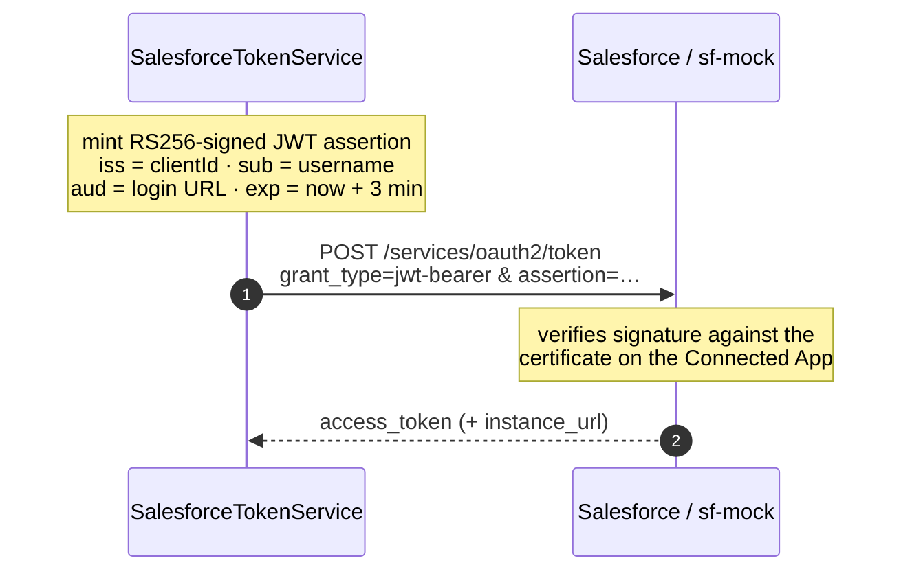

# ADR-0004 — Authenticate with the OAuth 2.0 JWT Bearer flow

| | |
| --- | --- |
| **Status** | Accepted |
| **Date** | 2026-07-20 |
| **Scope** | `cuentas-service` |
| **Related** | [ADR-0005](0005-token-cache-and-401-refresh.md), [ADR-0007](0007-protocol-faithful-mock.md) |

## Context

`cuentas-service` is a backend process. It calls Salesforce on behalf of the *system*, not on behalf
of a signed-in human, and it must be able to start unattended — a pod restarting at 03:00 cannot
wait for someone to approve a consent screen.

Salesforce offers several OAuth flows. Most assume a user agent:

- **Web server / user-agent flow** — needs a browser redirect and an interactive consent step.
- **Username-Password flow** — no browser, but requires storing a username, a password, and a
  security token in the deployment. Password rotation policies then break the service on a schedule.
- **Refresh token flow** — no browser after the first time, but the initial token still comes from an
  interactive flow, and the refresh token becomes a long-lived credential to guard and rotate.

## Decision

We use the **OAuth 2.0 JWT Bearer flow** (`urn:ietf:params:oauth:grant-type:jwt-bearer`),
implemented in `SalesforceTokenService`:



```java
String assertion = Jwt.claims()
        .issuer(config.auth().clientId())
        .subject(config.auth().username())
        .audience(config.auth().audience())
        .expiresIn(Duration.ofMinutes(3))
        .sign();
```

The **RS256 private key is the only secret**. Salesforce holds the matching public certificate on
the Connected App and never sees the key. The assertion is short-lived (3 minutes), so a captured
one is near-useless.

Token attachment is transparent to business code: `SalesforceAuthFilter` is a client request filter
on `SalesforceClient` that injects the `Authorization: Bearer …` header. The adapter never mentions
authentication.

## Consequences

**Positive**

- Fully unattended startup. No browser, no consent screen, no human in the loop.
- No password is stored anywhere, so password rotation policies do not break the integration.
- The private key never leaves our side; the credential Salesforce stores is a public certificate.
- Assertions expire in 3 minutes, bounding the value of an intercepted request.
- The filter keeps auth out of business code entirely — `SalesforceCrmAdapter` has no idea tokens
  exist, except to invalidate one on `401` ([ADR-0005](0005-token-cache-and-401-refresh.md)).

**Negative / accepted trade-offs**

- Requires key management: generating the keypair, uploading the certificate, and rotating both.
  This is real operational work that the Username-Password flow does not have.
- Requires Connected App setup in the org, including pre-authorizing the integration user's profile.
  A misconfigured `aud`, `iss`, or user pre-authorization fails with an opaque
  `invalid_grant` — hard to diagnose without knowing the flow.
- The private key must be mounted from a secrets manager in production. The repository ships a test
  key at `classpath:privateKey.pem` for local and CI use, and **baking that into a production image
  would be a security incident**.
- Clock skew matters. A server drifting more than the assertion lifetime fails to authenticate.

## Alternatives considered

| Alternative | Why not |
| --- | --- |
| Username-Password flow | Simplest to configure, but stores a password + security token in the deployment and breaks whenever the org's password policy forces a rotation. Salesforce also discourages it and orgs increasingly disable it. |
| Web server flow with a stored refresh token | Requires an interactive bootstrap, and the refresh token becomes a long-lived secret with the same rotation burden as a password. |
| Session ID from the SOAP `login()` call | Legacy, and it is a password-based flow wearing a different coat. |
| Named Credentials / platform-managed auth | Applies to code running *inside* Salesforce. We are an external service. |
