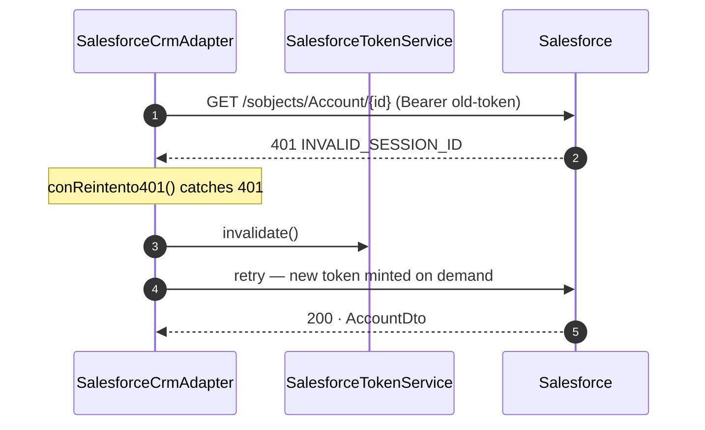

# ADR-0005 — Cache the access token locally, refresh it early, and recover from `401` transparently

| | |
| --- | --- |
| **Status** | Accepted |
| **Date** | 2026-07-20 |
| **Scope** | `cuentas-service` |
| **Related** | [ADR-0004](0004-oauth2-jwt-bearer-flow.md) |

## Context

Minting a token ([ADR-0004](0004-oauth2-jwt-bearer-flow.md)) costs an RS256 signature plus a network
round-trip to the login endpoint. Doing that per business call would double the latency of every
lookup and burn API quota on authentication.

But caching introduces two problems the naive version gets wrong:

1. **Stampede.** On a cold start under load, N concurrent requests all see an empty cache and all
   mint a token simultaneously.
2. **Server-side invalidation.** Salesforce sessions can end independently of any local TTL — an
   admin revokes them, the org's session settings expire them, a deploy resets them. A token that is
   "valid" by our clock can be dead on the server.

## Decision

Three mechanisms in combination.

**1 · Cache with early refresh.** `SalesforceTokenService` holds the token in an
`AtomicReference<CachedToken>` and treats it as expired 60 seconds before its nominal TTL:

```java
boolean isValid() {
    return Instant.now().isBefore(expiresAt.minusSeconds(60));
}
```

The 60-second margin means a token is never handed to a caller with so little life left that it
expires mid-flight.

**2 · Guarded refresh.** `refresh()` is `synchronized` and re-checks validity after acquiring the
lock, so concurrent callers that lost the race use the token the winner just minted:

```java
private synchronized String refresh() {
    CachedToken current = cached.get();
    if (current != null && current.isValid()) return current.token();   // someone else won
    …
}
```

The fast path (`getAccessToken()` with a valid token) never takes the lock.

**3 · Transparent `401` retry.** The local TTL is a guess about server state, so the adapter treats
`401` as authoritative: invalidate the cache and retry **once**.



`conReintento401(...)` wraps every CRM call, so all three operations get the behaviour without
repeating it.

## Consequences

**Positive**

- One token serves thousands of calls. Auth latency disappears from the hot path.
- No stampede: a cold start under concurrent load mints exactly one token.
- Session expiry is invisible to consumers — they see a slightly slower `200`, not a `500`.
- The `401` path is the safety net that makes an *approximate* local TTL acceptable. We do not need
  to model Salesforce's session policy correctly; we only need to recover when we guess wrong.

**Negative / accepted trade-offs**

- The retry is unconditional on `401`. If the credentials are genuinely wrong — bad key, revoked
  Connected App — every call costs two round-trips and two token mints before failing. This doubles
  load against an org that is already rejecting us.
- The retry happens **once**, not in a loop. A second `401` propagates. This is deliberate: a
  repeating `401` is a configuration problem, and retrying it harder will not fix it.
- `synchronized` serializes refreshes process-wide. Refresh is rare and short, but under a virtual-
  thread workload a pathological case could park many carriers on that monitor.
- The cache is per-process. A 20-pod deployment holds 20 tokens and mints 20 on rollout.
- Token TTL is configuration (`tokenTtlMinutes`), not read from the token response. Setting it
  longer than the org's actual session timeout shifts load onto the `401` path.

## Alternatives considered

| Alternative | Why not |
| --- | --- |
| Mint a token per request | Correct and stateless, but adds a signature + round-trip to every call and wastes API quota. |
| Cache without the `401` retry | Any server-side invalidation surfaces as a failed request until the local TTL happens to expire. |
| `401` retry without a cache | Works, but pays the per-request cost above for no benefit. |
| Background scheduled refresh | Keeps the token warm but adds a scheduler, refreshes while idle, and still needs the `401` path for unexpected invalidation. More moving parts, same guarantee. |
| Shared token cache (Redis) across pods | Cuts token mints on rollout, but adds a network dependency to the auth path and a new failure mode, to save an operation that already costs one round-trip per pod lifetime. |
| Non-blocking refresh (`AtomicReference.compareAndSet` on a future) | Avoids the monitor, but the lost-race callers must still wait on the in-flight refresh. Added complexity for a rare, short critical section. |
