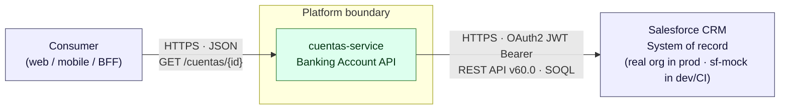
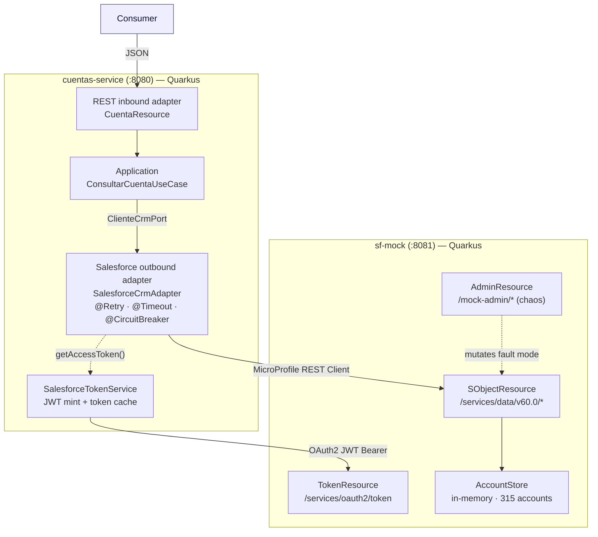
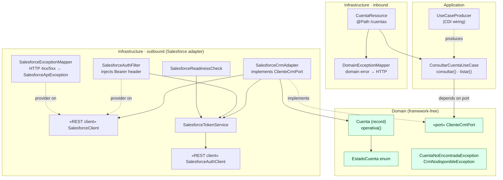
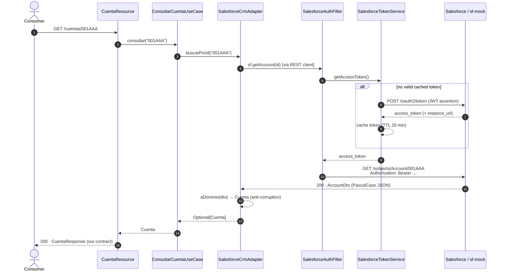
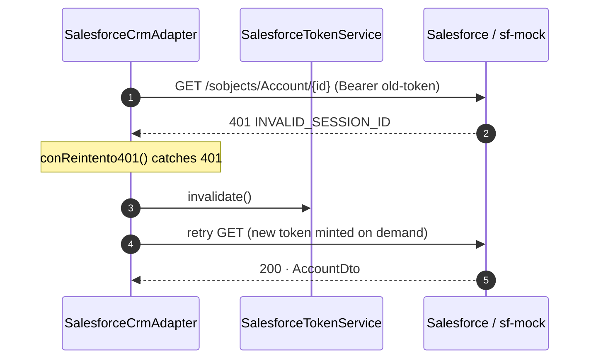
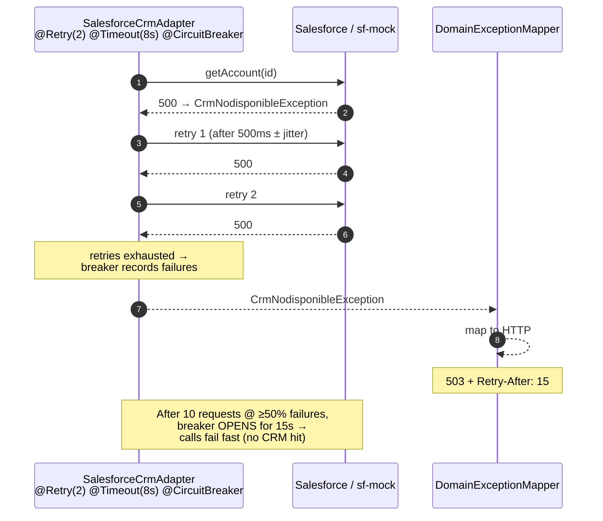
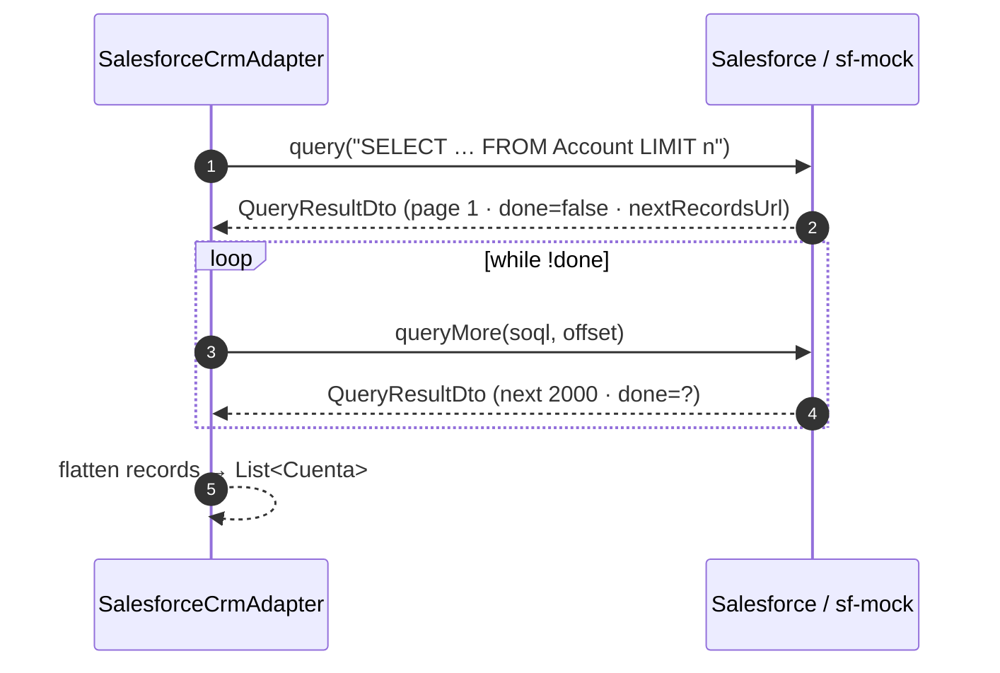
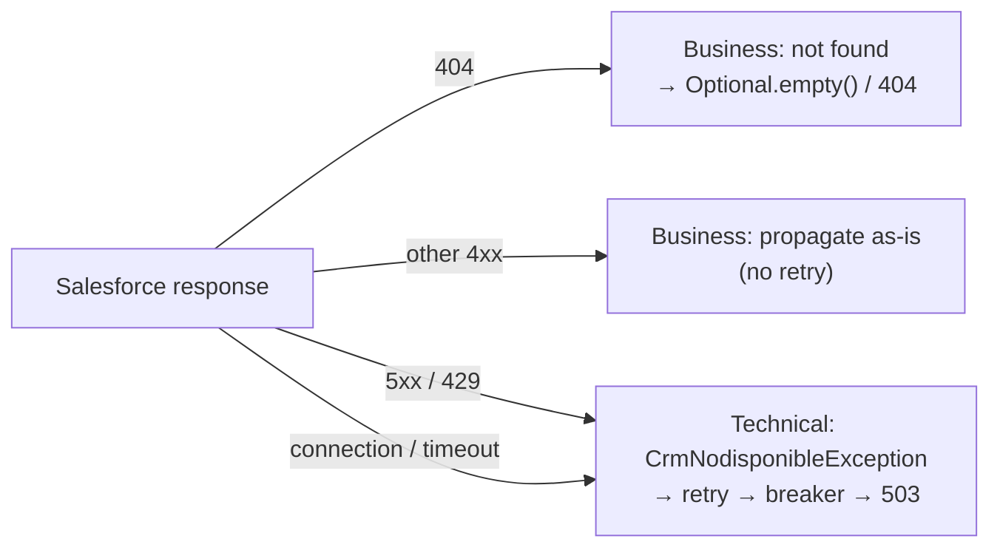
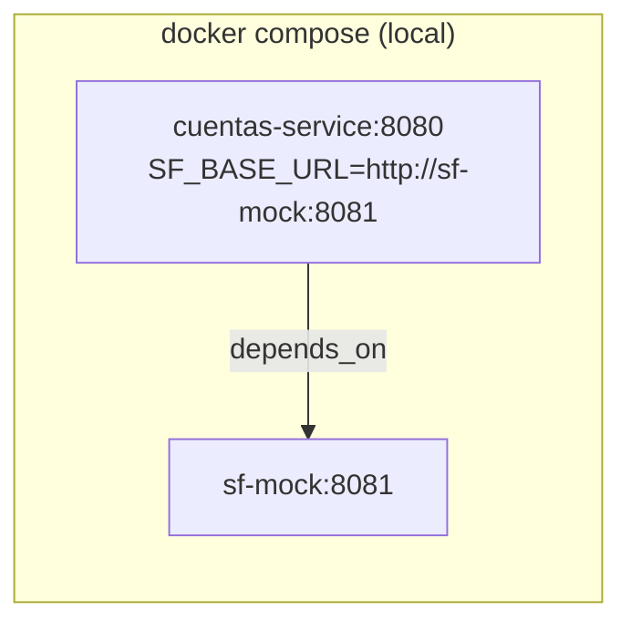
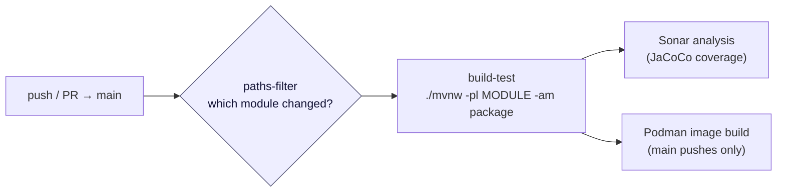

# Architecture Reference — Salesforce Banking Integration

> **Audience:** Solution architects evaluating patterns for integrating a system of record (Salesforce CRM) with a domain service under real-world reliability and security constraints.
>
> This repository is a **reference implementation**, not a product. It demonstrates how to isolate a volatile external dependency behind a clean domain boundary, make the integration resilient, and keep it fully testable without a live Salesforce org.

## Table of contents

1. [What this reference demonstrates](#1-what-this-reference-demonstrates)
2. [System context (C4 L1)](#2-system-context-c4-l1)
3. [Container view (C4 L2)](#3-container-view-c4-l2)
4. [Component view — `cuentas-service` (hexagonal)](#4-component-view--cuentas-service-hexagonal)
5. [Runtime behaviour (sequence diagrams)](#5-runtime-behaviour-sequence-diagrams)
6. [Cross-cutting concerns](#6-cross-cutting-concerns)
7. [Architecture decisions](#7-architecture-decisions)
8. [Deployment view](#8-deployment-view)
9. [CI/CD pipeline](#9-cicd-pipeline)

---

## 1. What this reference demonstrates

| Concern | Pattern applied | Where to look |
| --- | --- | --- |
| **Decoupling from the CRM** | Hexagonal architecture (ports & adapters) | `domain.port.out.ClienteCrmPort` ↔ `infrastructure.out.salesforce.SalesforceCrmAdapter` |
| **Protecting the domain from CRM data shapes** | Anti-corruption layer (DTO ↔ domain mapping) | `SalesforceCrmAdapter.aDominio(...)`, `EstadoCuenta.DESCONOCIDO` fallback |
| **Surviving CRM instability** | Retry + Timeout + Circuit Breaker (MicroProfile Fault Tolerance) | Annotations on `SalesforceCrmAdapter` |
| **Zero-touch authentication** | OAuth 2.0 JWT Bearer flow with token caching | `SalesforceTokenService`, `SalesforceAuthFilter` |
| **Business vs. technical error separation** | Exception translation + edge mapping | `traducir(...)`, `DomainExceptionMapper` |
| **Testability without a live org** | A protocol-faithful mock + chaos injection | `sf-mock` module |

The two containers:

| Container | Port | Role |
| --- | --- | --- |
| `cuentas-service` | `8080` | Banking account API. Owns the domain, resilience, and CRM integration. |
| `sf-mock` | `8081` | Stand-in for Salesforce REST API v60.0. Enables local dev, CI, and fault-injection testing. |

---

## 2. System context (C4 L1)



**Key point for architects:** consumers never see Salesforce semantics. The service exposes a small, stable contract (`CuentaResponse`) and absorbs every detail of the CRM — its auth flow, its field names, its error catalogue, and its failure modes.

---

## 3. Container view (C4 L2)



In production the `sf-mock` box is replaced by a real Salesforce org — **no code change** in `cuentas-service`, only the `SF_BASE_URL` / `SF_LOGIN_URL` configuration and real Connected App credentials.

---

## 4. Component view — `cuentas-service` (hexagonal)

The service is organized in three concentric layers. Dependencies point **inward only**: infrastructure depends on the domain, never the reverse.



### Layer responsibilities

| Layer | Package | Rule | Contents |
| --- | --- | --- | --- |
| **Domain** | `domain.*` | No framework imports. Pure Java. | `Cuenta`, `EstadoCuenta`, `ClienteCrmPort`, domain exceptions |
| **Application** | `application.*` | Orchestrates use cases against ports. | `ConsultarCuentaUseCase` (holds the business cap `min(limite, 10_000)`) |
| **Infrastructure** | `infrastructure.*` | All the "how". Swappable. | REST endpoints, Salesforce adapter, REST clients, auth, health, exception mappers |

**Why this matters:** `ConsultarCuentaUseCase` is a plain constructor-injected class with **zero Quarkus/JAX-RS dependencies** — it can be unit-tested with a hand-written fake `ClienteCrmPort` in microseconds. The `UseCaseProducer` is the single seam where CDI wires the concrete adapter into the port.

---

## 5. Runtime behaviour (sequence diagrams)

### 5.1 Account lookup — happy path

Shows the token being minted lazily on first use, cached, and attached transparently by the client filter.



### 5.2 Expired session — transparent 401 refresh

Salesforce sessions expire independently of the local TTL. The adapter recovers once, invisibly.



### 5.3 CRM instability — retry, then circuit breaker

`5xx` and `429` are translated to `CrmNodisponibleException`, which is what `@Retry` and `@CircuitBreaker` act on. Business `4xx` (e.g. 404) is **not** retried.



### 5.4 Paginated listing (SOQL)



---

## 6. Cross-cutting concerns

### 6.1 Resilience

| Mechanism | Scope | Configuration | Rationale |
| --- | --- | --- | --- |
| `@Retry` | all ops (2×; PATCH 1×) | 500 ms delay, 200 ms jitter, `retryOn = CrmNodisponibleException` | Absorb transient `5xx`/`429`/timeouts. **PATCH is idempotent** (same final state), so retrying is safe. A creating `POST` would *not* carry `@Retry` without an idempotency key — this is called out in the code. |
| `@Timeout` | all ops | 8 s | Bound the worst-case latency a consumer can experience. |
| `@CircuitBreaker` | account lookup | 10 requests, 50% failure ratio, 15 s open delay | Stop hammering a CRM that is already down; fail fast and shed load. |
| 401 refresh | all ops | invalidate token + 1 retry | Recover from server-side session expiry without surfacing an error. |

**Error taxonomy** — the adapter deliberately splits errors into two lanes:



### 6.2 Security — OAuth 2.0 JWT Bearer

Server-to-server auth with **no user interaction and no stored passwords**:

```
SalesforceTokenService
  ├─ mints an RS256-signed JWT assertion (privateKey.pem, iss=clientId, sub=username, aud, exp=3min)
  ├─ POST /services/oauth2/token  (grant_type = urn:ietf:params:oauth:grant-type:jwt-bearer)
  ├─ caches access_token (local TTL 20 min, refreshed 60 s early)
  └─ refresh() is synchronized → no token stampede under concurrency
```

- The private key is the only secret; in production it belongs in a secrets manager / mounted volume, **not** in the image.
- REST-client request/response logging is enabled **only** in the `%dev` profile — never with production data.

### 6.3 Observability

| Endpoint | Purpose | Notes |
| --- | --- | --- |
| `/q/health/live` | Liveness (K8s) | Process up. |
| `/q/health/ready` | Readiness (K8s) | Backed by `SalesforceReadinessCheck` — verifies it can obtain a Salesforce token. If the CRM auth is down, the pod is pulled from rotation. |
| `/q/health` | Aggregate | — |

### 6.4 Anti-corruption layer

The domain never imports a Salesforce DTO. Mapping happens in one place (`SalesforceCrmAdapter.aDominio`), and unknown CRM values are defensively coerced:

```java
// Any unexpected Estado_Cliente__c value from the CRM → DESCONOCIDO, never a crash.
estado = EstadoCuenta.valueOf(dto.estadoCliente());   // guarded by try/catch → DESCONOCIDO
```

This keeps CRM-side configuration drift (new picklist values, renamed fields) from propagating as `500`s into the consumer.

---

## 7. Architecture decisions

Lightweight ADR log — the "why" behind the structure.

| # | Decision | Rationale | Trade-off accepted |
| --- | --- | --- | --- |
| 1 | **Hexagonal architecture** | Isolate a volatile external system; keep domain unit-testable and the CRM swappable. | More classes/indirection for a small service. |
| 2 | **Own DTO (`CuentaResponse`) distinct from `AccountDto`** | Consumer contract must not leak Salesforce field names or evolve with the CRM. | Extra mapping code. |
| 3 | **Translate `5xx`/`429` → single `CrmNodisponibleException`** | One technical failure lane keeps fault-tolerance annotations and edge mapping simple. | Loses some granularity (all collapse to `503`). |
| 4 | **JWT Bearer flow (no interactive OAuth)** | Server-to-server integration; no user in the loop; no password storage. | Requires key management + Connected App setup. |
| 5 | **Local token cache with early refresh + `synchronized`** | Avoid a token request per call and prevent stampedes. | Slight risk of using a token invalidated server-side → covered by the 401 retry. |
| 6 | **`@Retry` on idempotent ops only** | Safe to repeat `GET`/`PATCH`; unsafe to repeat creating `POST` without an idempotency key. | Team must keep this discipline as new ops are added. |
| 7 | **Protocol-faithful mock (`sf-mock`) over recorded stubs** | Same wire format + chaos modes → production code path runs unchanged in dev & CI. | A second app to maintain. |
| 8 | **In-memory state in the mock** | Zero infra for local/CI; fast boot. | Not durable — by design. |

---

## 8. Deployment view



**Packaging options** (both modules): JVM jar, uber-jar, GraalVM native, and native-micro — Dockerfiles under each module's `src/main/docker/`. Native images boot in milliseconds, suited to scale-to-zero / serverless.

**Environment contract for `cuentas-service`:**

| Variable | Meaning | Local default |
| --- | --- | --- |
| `SF_BASE_URL` | Salesforce data API base | `http://localhost:8081` |
| `SF_LOGIN_URL` | Salesforce token endpoint base | `http://localhost:8081` |
| `app.salesforce.auth.*` | Connected App client id / username / audience | fake values for the mock |
| `smallrye.jwt.sign.key.location` | RS256 private key | `classpath:privateKey.pem` (replace in prod) |

**Kubernetes:** wire `/q/health/live` and `/q/health/ready` to liveness/readiness probes. Readiness gating on CRM auth means a pod only receives traffic once it can actually reach Salesforce.

---

## 9. CI/CD pipeline

Path-filtered, per-module matrix build (GitHub Actions, self-hosted runner):



- **`changes`** — `dorny/paths-filter` decides whether `sf-mock`, `cuentas-service`, or both need to run; a change to `pom.xml` triggers both.
- **`build-test`** — matrix over both modules; `-am` also builds needed reactor dependencies.
- **`sonar`** — quality gate fed by JaCoCo XML coverage; `sonar.projectKey` is set per module.
- **`docker`** — builds JVM images with Podman, tagged `latest` and the commit SHA; runs only on pushes to `main`.

---

## Where to go next

| You want to… | Read |
| --- | --- |
| Consume or operate the account API | [`cuentas-service/README.md`](../cuentas-service/README.md) |
| Understand / extend the Salesforce mock | [`sf-mock/README.md`](../sf-mock/README.md) |
| Build and run the whole stack | [root `README.md`](../README.md) |
