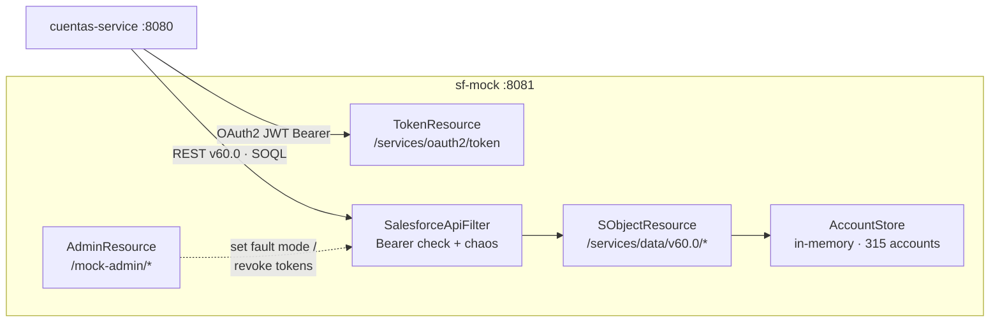

# sf-mock · Salesforce REST API Mock

A lightweight Quarkus server that simulates the **Salesforce REST API v60.0** — OAuth2 JWT Bearer flow, Account/Case sObjects, and SOQL queries — so you can develop and test integrations without a real Salesforce org.

Its defining feature for architects: it is **protocol-faithful**. The token response, the error payloads (`401`, `404`, `429`, `500`), and the `QueryResult` pagination format all match real Salesforce wire protocols — so the *production code path in `cuentas-service` runs unchanged* against it, in local dev and in CI.



> 📐 For how this fits the overall design, see [`../docs/architecture.md`](../docs/architecture.md).

## Why it exists

`cuentas-service` needs a Salesforce backend to talk to. Every request the real service makes — token acquisition, account lookup, SOQL pagination, case creation, account updates — is served by this mock.

It ships with **315 pre-loaded accounts** (`accounts.json`) and models the `Estado_Cliente__c` custom field (values: `ACTIVO`, `SUSPENDIDO`, `EN_REVISION`, `MOROSO`, `vip`), so the consumer's anti-corruption layer (unknown value → `DESCONOCIDO`) can be exercised for real.

```java
// What cuentas-service calls — all served by sf-mock, byte-compatible with Salesforce
salesforceClient.getAccount("001AAA");                     // GET   /services/data/v60.0/sobjects/Account/{id}
salesforceClient.query("SELECT+Id+FROM+Account+LIMIT+10"); // GET   /services/data/v60.0/query
salesforceClient.updateAccount(id, updates);               // PATCH /services/data/v60.0/sobjects/Account/{id}
```

## Chaos testing — fault injection as a first-class feature

Four modes simulate real Salesforce instability without touching a real org. This is what lets `cuentas-service` prove its `@Retry`, `@CircuitBreaker`, `@Timeout`, token-refresh, and health-check logic under controlled failure.

| Mode | Behaviour | Exercises in `cuentas-service` |
| --- | --- | --- |
| `OK` | Normal operation | Baseline / happy path |
| `ERROR_500` | All data-API calls return HTTP 500 | `@Retry` → `@CircuitBreaker` → `503` |
| `TIMEOUT` | 30-second sleep before responding | `@Timeout` (cuts at 8 s) → `503` |
| `RATE_LIMIT` | HTTP 429 with a Salesforce-shaped error | Rate-limit backoff → `503` |

The filter also enforces Bearer auth, so revoking tokens simulates a server-side session expiry:

```bash
curl -X POST http://localhost:8081/mock-admin/chaos/ERROR_500   # activate a fault mode
curl -X POST http://localhost:8081/mock-admin/chaos/OK          # back to normal
curl -X POST http://localhost:8081/mock-admin/revocar-tokens    # revoke tokens → next calls get 401
```

> Chaos and auth are enforced **only** on `/services/data/*` — the token endpoint and the admin panel stay reachable so you can always recover the mock.

## API reference

### Authentication

```
POST /services/oauth2/token
Content-Type: application/x-www-form-urlencoded

grant_type=urn:ietf:params:oauth:grant-type:jwt-bearer&assertion=<JWT>
```

Returns a mock `access_token` and an `instance_url`. The mock validates the JWT **shape** (three dot-separated parts); a real org verifies the signature against the Connected App's certificate — a deliberate, documented simplification.

### Salesforce REST API (v60.0)

| Method | Path | Description |
| --- | --- | --- |
| `GET` | `/services/data/v60.0/sobjects/Account/{id}` | Fetch account by id (`404` NOT_FOUND if absent) |
| `POST` | `/services/data/v60.0/sobjects/Case` | Create a case (always `201`) |
| `PATCH` | `/services/data/v60.0/sobjects/Account/{id}` | Update `Estado_Cliente__c` (`204`) |
| `GET` | `/services/data/v60.0/query?q=...` | SOQL query (reads `LIMIT`, paged every 2000) |
| `GET` | `/services/data/v60.0/query/more?q=...&offset=...` | Next page (`nextRecordsUrl` cursor) |

All `/services/data/...` endpoints require `Authorization: Bearer <token>`, validated against the in-memory token store.

### Admin

| Method | Path | Description |
| --- | --- | --- |
| `POST` | `/mock-admin/chaos/{modo}` | Set fault mode (`OK` / `ERROR_500` / `TIMEOUT` / `RATE_LIMIT`) |
| `POST` | `/mock-admin/revocar-tokens` | Invalidate all issued tokens |

## Run

### Dev mode (hot reload)

```bash
./mvnw quarkus:dev
```

### JAR / uber-JAR / native

```bash
./mvnw package                                            # runnable jar
java -jar target/quarkus-app/quarkus-run.jar

./mvnw package -Dquarkus.package.jar.type=uber-jar        # uber-jar
./mvnw package -Dnative                                   # native executable (boots in ms)
```

### Podman / Docker

```bash
./mvnw package
podman build -f src/main/docker/Dockerfile.jvm -t sf-mock .
podman run -d --rm -p 8081:8081 --name sf-mock sf-mock
```

All four Dockerfiles (`Dockerfile.jvm`, `.legacy-jar`, `.native`, `.native-micro`) live in `src/main/docker/` and use Red Hat UBI base images; they work with both `docker` and `podman`.

## Stack

- **Java 21** + **Quarkus 3.37.3**
- REST via `quarkus-rest-jackson`
- In-memory state (`ConcurrentHashMap`), no database — fast boot, ephemeral by design
- Container images: JVM, legacy-jar, native, native-micro
